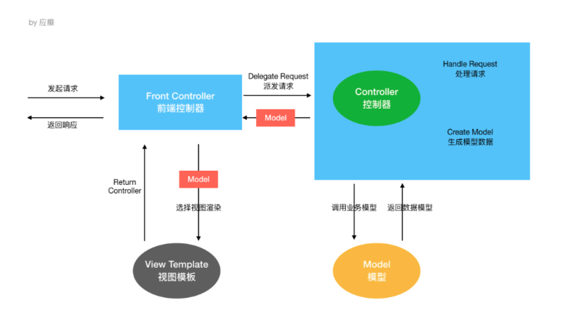
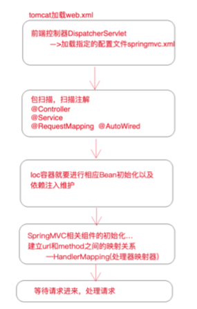

### SpringMVC框架

+ 内容
  + mvc应用
  + mvc高级技术
  + 手写mvc
  + 源码解析
  + ssm整合

#### mvc应用

+ mvc 请求处理流程

  

  + 第一步:用户发送请求至前端控制器DispatcherServlet 
  + 第二步:DispatcherServlet收到请求调用HandlerMapping处理器映射器
  + 第三步:处理器映射器根据请求Url找到具体的Handler(后端控制器)，生成处理器对象及处理器拦截 器(如果 有则生成)一并返回DispatcherServlet
  + 第四步:DispatcherServlet调用HandlerAdapter处理器适配器去调用Handler
  + 第五步:处理器适配器执行Handler
  + 第六步:Handler执行完成给处理器适配器返回ModelAndView
  + 第七步:处理器适配器向前端控制器返回 ModelAndView，ModelAndView 是SpringMVC 框架的一个 底层对 象，包括 Model 和 View
  + 第八步:前端控制器请求视图解析器去进行视图解析，根据逻辑视图名来解析真正的视图。 
  + 第九步:视图解析器向前端控制器返回View
  +  第十步:前端控制器进行视图渲染，就是将模型数据(在 ModelAndView 对象中)填充到 request 域 第十一步:前端控制器向用户响应结果

+ mvc开发流程

  + 1)配置DispatcherServlet前端控制器 
  + 2)开发处理具体业务逻辑的Handler(@Controller、@RequestMapping) 
  + 3)xml配置文件配置controller扫描，配置springmvc三大件 
  + 4)将xml文件路径告诉springmvc(DispatcherServlet)

+ mvc九大组件

  + HandlerMapping(处理器映射器)
    + HandlerMapping 是用来查找 Handler 的，也就是处理器，具体的表现形式可以是类，也可以是 方法。比如，标注了@RequestMapping的每个方法都可以看成是一个Handler。Handler负责具 体实际的请求处理，在请求到达后，HandlerMapping 的作用便是找到请求相应的处理器 Handler 和 Interceptor.
  + HandlerAdapter(处理器适配器)
    + HandlerAdapter 是一个适配器。因为 Spring MVC 中 Handler 可以是任意形式的，只要能处理请 求即可。但是把请求交给 Servlet 的时候，由于 Servlet 的方法结构都是 doService(HttpServletRequest req,HttpServletResponse resp)形式的，要让固定的 Servlet 处理 方法调用 Handler 来进行处理，便是 HandlerAdapter 的职责。
  + HandlerExceptionResolver
    + HandlerExceptionResolver 用于处理 Handler 产生的异常情况。它的作用是根据异常设置ModelAndView，之后交给渲染方法进行渲染，渲染方法会将 ModelAndView 渲染成⻚面。
  + ViewResolver
    + ViewResolver即视图解析器，用于将String类型的视图名和Locale解析为View类型的视图，只有一 个resolveViewName()方法。从方法的定义可以看出，Controller层返回的String类型视图名 viewName 最终会在这里被解析成为View。View是用来渲染⻚面的，也就是说，它会将程序返回 的参数和数据填入模板中，生成html文件。ViewResolver 在这个过程主要完成两件事情: ViewResolver 找到渲染所用的模板(第一件大事)和所用的技术(第二件大事，其实也就是找到 视图的类型，如JSP)并填入参数。默认情况下，Spring MVC会自动为我们配置一个 InternalResourceViewResolver,是针对 JSP 类型视图的。
  + RequestToViewNameTranslator
    + RequestToViewNameTranslator 组件的作用是从请求中获取 ViewName.因为 ViewResolver 根据 ViewName 查找 View，但有的 Handler 处理完成之后,没有设置 View，也没有设置 ViewName， 便要通过这个组件从请求中查找 ViewName。
  + LocaleResolver
    + ViewResolver 组件的 resolveViewName 方法需要两个参数，一个是视图名，一个是 Locale。 LocaleResolver 用于从请求中解析出 Locale，比如中国 Locale 是 zh-CN，用来表示一个区域。这 个组件也是 i18n 的基础。
  + ThemeResolver
    + ThemeResolver 组件是用来解析主题的。主题是样式、图片及它们所形成的显示效果的集合。 Spring MVC 中一套主题对应一个 properties文件，里面存放着与当前主题相关的所有资源，如图 片、CSS样式等。创建主题非常简单，只需准备好资源，然后新建一个“主题名.properties”并将资 源设置进去，放在classpath下，之后便可以在⻚面中使用了。SpringMVC中与主题相关的类有 ThemeResolver、ThemeSource和Theme。ThemeResolver负责从请求中解析出主题名， ThemeSource根据主题名找到具体的主题，其抽象也就是Theme，可以通过Theme来获取主题和 具体的资源。
  + MultipartResolver
    + MultipartResolver 用于上传请求，通过将普通的请求包装成 MultipartHttpServletRequest 来实 现。MultipartHttpServletRequest 可以通过 getFile() 方法 直接获得文件。如果上传多个文件，还 可以调用 getFileMap()方法得到Map<FileName，File>这样的结构，MultipartResolver 的作用就 是封装普通的请求，使其拥有文件上传的功能。
  + FlashMapManager
    + FlashMap 用于重定向时的参数传递，比如在处理用户订单时候，为了避免重复提交，可以处理完 post请求之后重定向到一个get请求，这个get请求可以用来显示订单详情之类的信息。这样做虽然 可以规避用户重新提交订单的问题，但是在这个⻚面上要显示订单的信息，这些数据从哪里来获得 呢?因为重定向时么有传递参数这一功能的，如果不想把参数写进URL(不推荐)，那么就可以通 过FlashMap来传递。只需要在重定向之前将要传递的数据写入请求(可以通过ServletRequestAttributes.getRequest()方法获得)的属性OUTPUT_FLASH_MAP_ATTRIBUTE 中，这样在重定向之后的Handler中Spring就会自动将其设置到Model中，在显示订单信息的⻚面 上就可以直接从Model中获取数据。FlashMapManager 就是用来管理 FalshMap 的。

+ Springmvc的url-pattern配置以及原理解析

  + 见SpringMvcDemo项目文件的web.xml部分

+ 数据输出机制Model,Map,ModelMap回顾

  + 见SpringMvcDemo项目文件中的controller.DemoController部分

+ 请求参数绑定

  + 原始的servlet获取一个整数类型变量

    + String str = request.getParameter("age")
    + Integer i = Integer.parseInt(str);

  + SpringMvc对servlet进行了封装，简化了servlet的操作，Spring在接受整型参数时，直接在handler方法中声明形参即可

    ```java
    		@RequestMapping("/xxx")
        public void handle(Integer i) {
            System.out.println(i);
        }
    ```

  + 参数绑定:取出参数值绑定到handler方法的形参上

    + 默认支持 Servlet API 作为方法参数

      当需要使用HttpServletRequest、HttpServletResponse、HttpSession等原生servlet对象时，直 接在handler方法中形参声明使用即可。

      ```java
      *
           * 如果要在SpringMVC中使用servlet原生对象，比如HttpServletRequest\HttpServletResponse\HttpSession，直接在Handler方法形参中声明使用即可
           *
           */
          @RequestMapping("/handle02")
          public ModelAndView handle02(HttpServletRequest request, HttpServletResponse response, HttpSession session) {
              String id = request.getParameter("id");
      
              Date date = new Date();
              ModelAndView modelAndView = new ModelAndView();
              modelAndView.addObject("date",date);
              modelAndView.setViewName("success");
              return modelAndView;
          }
      ```

  + 绑定简单类型参数

    + 简单数据类型:八种基本数据类型及其包装类型 参数类型推荐使用包装数据类型，因为基础数据类型不可以为null 整型:
      + Integer、int
      + 字符串:String
      + 单精度:Float、float
      + 双精度:Double、double
      + 布尔型:Boolean、boolean 说明:对于布尔类型的参数，请求的参数值为**true**或**false**。或者**1**或**0**
    + 注意:绑定简单数据类型参数，只需要直接声明形参即可(形参参数名和传递的参数名要保持一 致，建议 使用包装类型，当形参参数名和传递参数名不一致时可以使用@RequestParam注解进行 手动映射)

+ Restful风格的请求支持

  + rest⻛格请求是什么样的? 

    + springmvc对rest⻛格请求到底提供了怎样的支持 是一个注解的使用@PathVariable，可以帮助我们从uri中取出参数

  + 什么是 RESTful

  + Restful 是一种 web 软件架构⻛格，它不是标准也不是协议，它倡导的是一个资源定位及资源操作的⻛

    格。

    + 什么是 **REST**:
      + REST(英文:Representational State Transfer，简称 REST)描述了一个架构样式的网络系统， 比如 web 应用程序。它首次出现在 2000 年 Roy Fielding 的博士论文中，他是 HTTP 规范的主要编写者之 一。在目前主流的三种 Web 服务交互方案中，REST 相比于 SOAP(Simple Object Access protocol， 简单对象访问协议)以及 XML-RPC 更加简单明了，无论是对 URL 的处理还是对 Payload 的编码， REST 都倾向于用更加简单轻量的方法设计和实现。值得注意的是 REST 并没有一个明确的标准，而更像 是一种设计的⻛格。
      + 它本身并没有什么实用性，其核心价值在于如何设计出符合 REST ⻛格的网络接口。 资源 表现层 状态转移
         **Restful** 的优点 它结构清晰、符合标准、易于理解、扩展方便，所以正得到越来越多网站的采用。 **Restful** 的特性 资源(Resources):网络上的一个实体，或者说是网络上的一个具体信息。
      + 它可以是一段文本、一张图片、一首歌曲、一种服务，总之就是一个具体的存在。可以用一个 URI(统 一资源定位符)指向它，每种资源对应一个特定的 URI 。要获取这个资源，访问它的 URI 就可以，因此 URI 即为每一个资源的独一无二的识别符。
      + 表现层(Representation):把资源具体呈现出来的形式，叫做它的表现层 (Representation)。比 如，文本可以用 txt 格式表现，也可以用 HTML 格式、XML 格式、JSON 格式表现，甚至可以采用二进 制格式。
      + 状态转化(State Transfer):每发出一个请求，就代表了客户端和服务器的一次交互过程。
      + HTTP 协议，是一个无状态协议，即所有的状态都保存在服务器端。因此，如果客户端想要操作服务 器， 必须通过某种手段，让服务器端发生“状态转化”(State Transfer)。而这种转化是建立在表现层 之上的，所以就是 “ 表现层状态转化” 。具体说， 就是 HTTP 协议里面，四个表示操作方式的动词: GET 、POST 、PUT 、DELETE 。它们分别对应四种基本操作:GET 用来获取资源，POST 用来新建资 源，PUT 用来更新资源，DELETE 用来删除资源。

  + post表单提交中文乱码问题

    + web.xml

      ```xml
      <!--springmvc提供的针对post请求的编码过滤器-->
        <filter>
          <filter-name>encoding</filter-name>
          <filter-class>org.springframework.web.filter.CharacterEncodingFilter</filter-class>
          <init-param>
            <param-name>encoding</param-name>
            <param-value>UTF-8</param-value>
          </init-param>
        </filter>
      
        <filter-mapping>
          <filter-name>encoding</filter-name>
          <url-pattern>/*</url-pattern>
        </filter-mapping>
      ```

    + get请求乱码（配置tomcat下的server.xml）

      ```xml
       <Connector URIEncoding="utf-8" connectionTimeout="20000" port="8080"
      protocol="HTTP/1.1" redirectPort="8443"/>
      ```

  + mvc对put和delete方法的支持，前端表单只能配置post和get请求，但是后端为RequestMethod为DELETE和PUT，不进行配置会报错

    + web.xml

      ```xml
      <!--配置springmvc请求方式转换过滤器，会检查请求参数中是否有_method参数，如果有就按照指定的请求方式进行转换-->
        <filter>
          <filter-name>hiddenHttpMethodFilter</filter-name>
          <filter-class>org.springframework.web.filter.HiddenHttpMethodFilter</filter-class>
        </filter>
      
        <filter-mapping>
          <filter-name>hiddenHttpMethodFilter</filter-name>
          <url-pattern>/*</url-pattern>
        </filter-mapping>
      ```

+ ajax和json交互

  + 交互:两个方向 

    + 前端到后台:前端ajax发送json格式字符串，后台直接接收为pojo参数，使用注解@RequstBody
    + 后台到前端:后台直接返回pojo对象，前端直接接收为json对象或者字符串，使用注解 @ResponseBody

  + 什么是 **Json** 

    + Json是一种与语言无关的数据交互格式，就是一种字符串，只是用特殊符号{}内表示对象、[]内表示数

    组、""内是属性或值、:表示后者是前者的值{"name": "Michael"}可以理解为是一个包含name为Michael的对象 [{"name": "Michael"},{"name": "Jerry"}]就表示包含两个对象的数组

  + @ResponseBody注解

    + @responseBody注解的作用是将controller的方法返回的对象通过适当的转换器转换为指定的格式之 后，写入到response对象的body区，通常用来返回JSON数据或者是XML数据。 注意:在使用此注解之 后不会再走视图处理器，而是直接将数据写入到输入流中，他的效果等同于通过response对象输出指定 格式的数据。

  + 分析**Spring MVC** 使用 **Json** 交互 所需jar包

    ```xml
     
    <!--json数据交互所需jar，start--> 
    <dependency>
      <groupId>com.fasterxml.jackson.core</groupId>
      <artifactId>jackson-core</artifactId>
      <version>2.9.0</version>
    </dependency>
    <dependency>
      <groupId>com.fasterxml.jackson.core</groupId>
      <artifactId>jackson-databind</artifactId>
      <version>2.9.0</version>
      </dependency>
      <dependency>
        <groupId>com.fasterxml.jackson.core</groupId>
        <artifactId>jackson-annotations</artifactId>
        <version>2.9.0</version>
      </dependency>
      <!--json数据交互所需jar，end-->
    ```

  + mvc引入前端js失败，配置spring-mvc资源

    + Spring-mvc.xml

      ```xml
      <mvc:resources location="/WEB-INF/js/" mapping="/js/**" />
      ```

      

#### mvc高级技术

##### 拦截器**(Inteceptor)**使用

+ 监听器、过滤器和拦截器对比 Servlet:处理Request请求和Response响应

+ 过滤器(Filter):对Request请求起到过滤的作用，作用在Servlet之前，如果配置为/*可以对所 有的资源访问(servlet、js/css静态资源等)进行过滤处理

+ 监听器(Listener):实现了javax.servlet.ServletContextListener 接口的服务器端组件，它随 Web应用的启动而启动，只初始化一次，然后会一直运行监视，随Web应用的停止而销毁

  + 作用一:做一些初始化工作，web应用中spring容器启动ContextLoaderListener
  + 作用二:监听web中的特定事件，比如HttpSession,ServletRequest的创建和销毁;变量的创建、 销毁和修改等。可以在某些动作前后增加处理，实现监控，比如统计在线人数，利用 HttpSessionLisener等。

+ 拦截器(Interceptor):是SpringMVC、Struts等表现层框架自己的，不会拦截 jsp/html/css/image的访问等，只会拦截访问的控制器方法(Handler)。

  + 从配置的⻆度也能够总结发现:
    + serlvet、filter、listener是配置在web.xml中的，而interceptor是 配置在表现层框架自己的配置文件中的
      + 在Handler业务逻辑执行之前拦截一次 
      + 在Handler逻辑执行完毕但未跳转⻚面之前拦截一次 
      + 在跳转⻚面之后拦截一次

+ 配置拦截器

  + 编写类

  + 在springmvc.xml中配置

    ```xml
    <mvc:interceptors>
        <!--  拦截所有url  -->
    <!--        <bean class="com.lagou.edu.interceptor.MyIntercepter01"/>-->
        <mvc:interceptor>
            <!-- /** 表示根目录及其子目录 -->
            <mvc:mapping path="/**"/>
            <!-- 排除目录 -->
            <!-- <mvc:exclude-mapping path="/demo/**"/>-->
            <bean class="com.lagou.edu.interceptor.MyIntercepter01"/>
        </mvc:interceptor>
    </mvc:interceptors>
    ```

#### 文件上传

+ jar包

  ```xml
   <!--文件上传所需jar坐标--> 
  <dependency>
    <groupId>commons-fileupload</groupId>
    <artifactId>commons-fileupload</artifactId>
    <version>1.3.1</version>
  </dependency>
  ```

+ Spring.xml配置文件上传解析器

  ```xml
  <!--配置文件上传解析器，id是固定的multipartResolver-->
  <bean id="multipartResolver" class="org.springframework.web.multipart.commons.CommonsMultipartResolver">
  <!--设置上传大小，单位字节-->
      <property name="maxUploadSize" value="1000000000"/>
  </bean>
  ```

+ 前端

  ```html
   
  <%--
    1 method="post"
    2 enctype="multipart/form-data"
    3 type="file"
  --%>
  <form method="post" enctype="multipart/form-data" action="/demo/upload">
    <input type="file" name="uploadFile"/>
  <input type="submit" value="上传"/> </form>
  ```

+ 后端

  ```java
   
  @RequestMapping("upload")
  public String upload(MultipartFile uploadFile, HttpServletRequest request)
  throws IOException {
    // 文件原名，如xxx.jpg
    String originalFilename = uploadFile.getOriginalFilename(); // 获取文件的扩展名,如jpg
    String extendName =
    originalFilename.substring(originalFilename.lastIndexOf(".") + 1,
    originalFilename.length());
    String uuid = UUID.randomUUID().toString(); // 新的文件名字
    String newName = uuid + "." + extendName; String realPath =
    request.getSession().getServletContext().getRealPath("/uploads");
    // 解决文件夹存放文件数量限制，按日期存放
    String datePath = new SimpleDateFormat("yyyy-MM-dd").format(new Date()); File floder = new File(realPath + "/" + datePath);
    if(!floder.exists()) {
            floder.mkdirs();
        }
        uploadFile.transferTo(new File(floder,newName));
        return "success";
  }
  ```

  

+ 异常处理

  ```java
  // 可以让我们优雅的捕获所有Controller对象handler方法抛出的异常 @ControllerAdvice
  @ControllerAdvice
  public class GlobalExceptionResolver {
      @ExceptionHandler(ArithmeticException.class)
      public ModelAndView handleException(ArithmeticException exception,
  HttpServletResponse response) {
        ModelAndView modelAndView = new ModelAndView();
        modelAndView.addObject("msg",exception.getMessage());
        modelAndView.setViewName("error");
        return modelAndView;
      } 
  }
  ```

+ springmvc重定向参数传递问题

  + 重定向时请求参数会丢失，我们往往需要重新携带请求参数，我们可以进行手动参数拼接如下:

    ```
      return "redirect:handle01?name=" + name;
    ```

  + 但是上述拼接参数的方法属于get请求，携带参数⻓度有限制，参数安全性也不高，此时，我们可以使 用SpringMVC提供的flash属性机制，向上下文中添加flash属性，框架会在session中记录该属性值，当 跳转到⻚面之后框架会自动删除flash属性，不需要我们手动删除，通过这种方式进行重定向参数传递， 参数⻓度和安全性都得到了保障，如下:

    ```java
    @RequestMapping("/handleRedirect")
        public String handleRedirect(String name,RedirectAttributes
    redirectAttributes) {
    //return "redirect:handle01?name=" + name; // 拼接参数安全性、参数⻓度都有
    局限
    // addFlashAttribute方法设置了一个flash类型属性，该属性会被暂存到session中，在 跳转到⻚面之后该属性销毁
            redirectAttributes.addFlashAttribute("name",name);
            return "redirect:handle01";
        }
    ```

    

#### 手写mvc

+ mvc流程

  

#### 源码解析

#### ssm整合

+ ssm = Spring + SpringMvc + Mybatis

+ 先整合spring+mybatis再整合springMVC

+ mybatis整合spring

  + 整合目标
    + 数据库连接池以及事务管理都交给Spring容器来完成
    + SqlSessionFactory对象应该放到Spring容器中作为单例对象管理
    + Mapper动态代理对象交给Spring管理，我们从Spring容器中直接获得Mapper的代理对象
  + 整合所需 Jar 分析
  + Junit测试jar(4.12版本)
  + Mybatis的jar(3.4.5) 
  + Spring相关jar(spring-context、spring-test、spring-jdbc、spring-tx、spring-aop、 aspectjweaver)
  + Mybatis/Spring整合包jar(mybatis-spring-xx.jar)
  + Mysql数据库驱动jar
  + Druid数据库连接池的jar

+ 整合后的pom坐标

  ```xml
  <properties>
      <project.build.sourceEncoding>UTF-8</project.build.sourceEncoding>
      <maven.compiler.source>11</maven.compiler.source>
      <maven.compiler.target>11</maven.compiler.target>
    </properties>
  
    <dependencies>
      <!--junit-->
      <dependency>
        <groupId>junit</groupId>
        <artifactId>junit</artifactId>
        <version>4.12</version>
        <scope>test</scope>
      </dependency>
      <!--mybatis-->
      <dependency>
        <groupId>org.mybatis</groupId>
        <artifactId>mybatis</artifactId>
        <version>3.4.5</version>
      </dependency>
      <!--spring相关-->
      <dependency>
        <groupId>org.springframework</groupId>
        <artifactId>spring-context</artifactId>
        <version>5.1.12.RELEASE</version>
      </dependency>
      <dependency>
        <groupId>org.springframework</groupId>
        <artifactId>spring-test</artifactId>
        <version>5.1.12.RELEASE</version>
      </dependency>
      <dependency>
        <groupId>org.springframework</groupId>
        <artifactId>spring-jdbc</artifactId>
        <version>5.1.12.RELEASE</version>
      </dependency>
      <dependency>
        <groupId>org.springframework</groupId>
        <artifactId>spring-tx</artifactId>
        <version>5.1.12.RELEASE</version>
      </dependency>
      <dependency>
        <groupId>org.springframework</groupId>
        <artifactId>spring-aop</artifactId>
        <version>5.1.12.RELEASE</version>
      </dependency>
      <dependency>
        <groupId>org.aspectj</groupId>
        <artifactId>aspectjweaver</artifactId>
        <version>1.8.9</version>
      </dependency>
      <!--mybatis与spring的整合包-->
      <dependency>
        <groupId>org.mybatis</groupId>
        <artifactId>mybatis-spring</artifactId>
        <version>2.0.3</version>
      </dependency>
      <!--数据库驱动jar-->
      <dependency>
        <groupId>mysql</groupId>
        <artifactId>mysql-connector-java</artifactId>
        <version>5.1.46</version>
      </dependency>
      <!--druid连接池-->
      <dependency>
        <groupId>com.alibaba</groupId>
        <artifactId>druid</artifactId>
        <version>1.1.21</version>
      </dependency>
  
  
      <!--SpringMVC-->
      <dependency>
        <groupId>org.springframework</groupId>
        <artifactId>spring-webmvc</artifactId>
        <version>5.1.12.RELEASE</version>
      </dependency>
      <!--jsp-api&servlet-api-->
      <dependency>
        <groupId>javax.servlet</groupId>
        <artifactId>jsp-api</artifactId>
        <version>2.0</version>
        <scope>provided</scope>
      </dependency>
      <dependency>
        <groupId>javax.servlet</groupId>
        <artifactId>javax.servlet-api</artifactId>
        <version>3.1.0</version>
        <scope>provided</scope>
      </dependency>
      <!--页面使用jstl表达式-->
      <dependency>
        <groupId>jstl</groupId>
        <artifactId>jstl</artifactId>
        <version>1.2</version>
      </dependency>
      <dependency>
        <groupId>taglibs</groupId>
        <artifactId>standard</artifactId>
        <version>1.1.2</version>
      </dependency>
  
      <!--json数据交互所需jar，start-->
      <dependency>
        <groupId>com.fasterxml.jackson.core</groupId>
        <artifactId>jackson-core</artifactId>
        <version>2.9.0</version>
      </dependency>
      <dependency>
        <groupId>com.fasterxml.jackson.core</groupId>
        <artifactId>jackson-databind</artifactId>
        <version>2.9.0</version>
      </dependency>
      <dependency>
        <groupId>com.fasterxml.jackson.core</groupId>
        <artifactId>jackson-annotations</artifactId>
        <version>2.9.0</version>
      </dependency>
      <!--json数据交互所需jar，end-->
    </dependencies>
  
  
    <build>
      <plugins>
        <!--tomcat插件-->
        <plugin>
          <groupId>org.apache.tomcat.maven</groupId>
          <artifactId>tomcat7-maven-plugin</artifactId>
          <version>2.2</version>
          <configuration>
            <port>8080</port>
            <path>/</path>
          </configuration>
        </plugin>
      </plugins>
    </build>
  ```

+ 整合后的jdbc.properties

  ```properti
  jdbc.driver=com.mysql.jdbc.Driver
  jdbc.url=jdbc:mysql://localhost:3306/bank
  jdbc.username=root
  jdbc.password=123456
  ```

+ spring配置文件

  + applicationContext-dao.xml

    ```xml
    <?xml version="1.0" encoding="UTF-8"?>
    <beans xmlns="http://www.springframework.org/schema/beans"
           xmlns:context="http://www.springframework.org/schema/context"
           xmlns:tx="http://www.springframework.org/schema/tx"
           xmlns:xsi="http://www.w3.org/2001/XMLSchema-instance"
           xsi:schemaLocation="
           http://www.springframework.org/schema/beans
           http://www.springframework.org/schema/beans/spring-beans.xsd
           http://www.springframework.org/schema/context
           http://www.springframework.org/schema/context/spring-context.xsd
           http://www.springframework.org/schema/tx
           http://www.springframework.org/schema/tx/spring-tx.xsd
    ">
    
        <!--包扫描-->
        <context:component-scan base-package="com.lagou.edu.mapper"/>
    
    
        <!--数据库连接池以及事务管理都交给Spring容器来完成-->
    
            <!--引入外部资源文件-->
            <context:property-placeholder location="classpath:jdbc.properties"/>
    
            <!--第三方jar中的bean定义在xml中-->
            <bean id="dataSource" class="com.alibaba.druid.pool.DruidDataSource">
                <property name="driverClassName" value="${jdbc.driver}"/>
                <property name="url" value="${jdbc.url}"/>
                <property name="username" value="${jdbc.username}"/>
                <property name="password" value="${jdbc.password}"/>
            </bean>
    
    
    
        <!--SqlSessionFactory对象应该放到Spring容器中作为单例对象管理
    
            原来mybaits中sqlSessionFactory的构建是需要素材的：SqlMapConfig.xml中的内容
        -->
        <bean id="sqlSessionFactory" class="org.mybatis.spring.SqlSessionFactoryBean">
            <!--别名映射扫描-->
            <property name="typeAliasesPackage" value="com.lagou.edu.pojo"/>
            <!--数据源dataSource-->
            <property name="dataSource" ref="dataSource"/>
        </bean>
    
    
    
        <!--Mapper动态代理对象交给Spring管理，我们从Spring容器中直接获得Mapper的代理对象-->
        <!--扫描mapper接口，生成代理对象，生成的代理对象会存储在ioc容器中-->
        <bean class="org.mybatis.spring.mapper.MapperScannerConfigurer">
            <!--mapper接口包路径配置-->
            <property name="basePackage" value="com.lagou.edu.mapper"/>
            <property name="sqlSessionFactoryBeanName" value="sqlSessionFactory"/>
        </bean>
    
    </beans>
    ```

    

  + applicationContext-service.xml

    ```xml
    <?xml version="1.0" encoding="UTF-8"?>
    <beans xmlns="http://www.springframework.org/schema/beans"
           xmlns:context="http://www.springframework.org/schema/context"
           xmlns:tx="http://www.springframework.org/schema/tx"
           xmlns:xsi="http://www.w3.org/2001/XMLSchema-instance"
           xsi:schemaLocation="
           http://www.springframework.org/schema/beans
           http://www.springframework.org/schema/beans/spring-beans.xsd
           http://www.springframework.org/schema/context
           http://www.springframework.org/schema/context/spring-context.xsd
           http://www.springframework.org/schema/tx
           http://www.springframework.org/schema/tx/spring-tx.xsd
    ">
    
        <!--包扫描-->
        <context:component-scan base-package="com.lagou.edu.service"/>
    
    
    
        <!--事务管理-->
        <bean id="transactionManager" class="org.springframework.jdbc.datasource.DataSourceTransactionManager">
            <property name="dataSource" ref="dataSource"/>
        </bean>
    
        <!--事务管理注解驱动-->
        <tx:annotation-driven transaction-manager="transactionManager"/>
    
    
    
    </beans>
    ```

    

+ 测试接口文件

  + AccountMapper接口

+ 测试映射文件

  + AccountMapper.xml

    ```xml
    <!DOCTYPE mapper PUBLIC "-//mybatis.org//DTD Mapper 3.0//EN" "http://mybatis.org/dtd/mybatis-3-mapper.dtd">
    <mapper namespace="com.lagou.edu.mapper.AccountMapper">
    
        <select id="queryAccountList" resultType="com.lagou.edu.pojo.Account">
            select * from account
        </select>
    </mapper>
    ```

    

+ 测试文件

  ```java
  @RunWith(SpringJUnit4ClassRunner.class)
  @ContextConfiguration(locations = {"classpath*:application*.xml"})
  public class MybatisSpringTest {
  // 希望测试ioc容器中的哪个对象你注入即可。 @Autowired
  private AccountService accountService;
  @Test
  public void testMybatisSpring() throws Exception {
      List<Account> accounts = accountService.queryAccountList();
      for (int i = 0; i < accounts.size(); i++) {
          Account account =  accounts.get(i);
          System.out.println(account);
      }
    }
  }
  ```

  

#### springData


